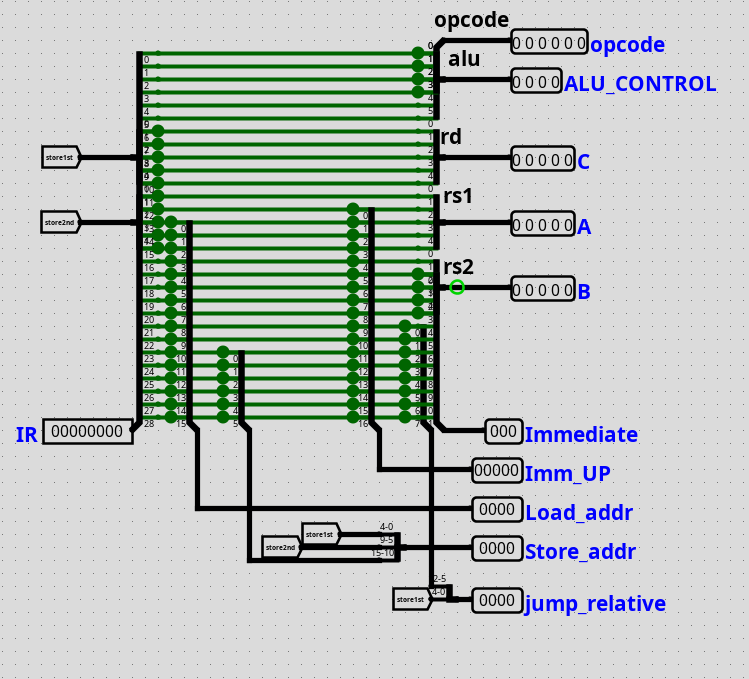
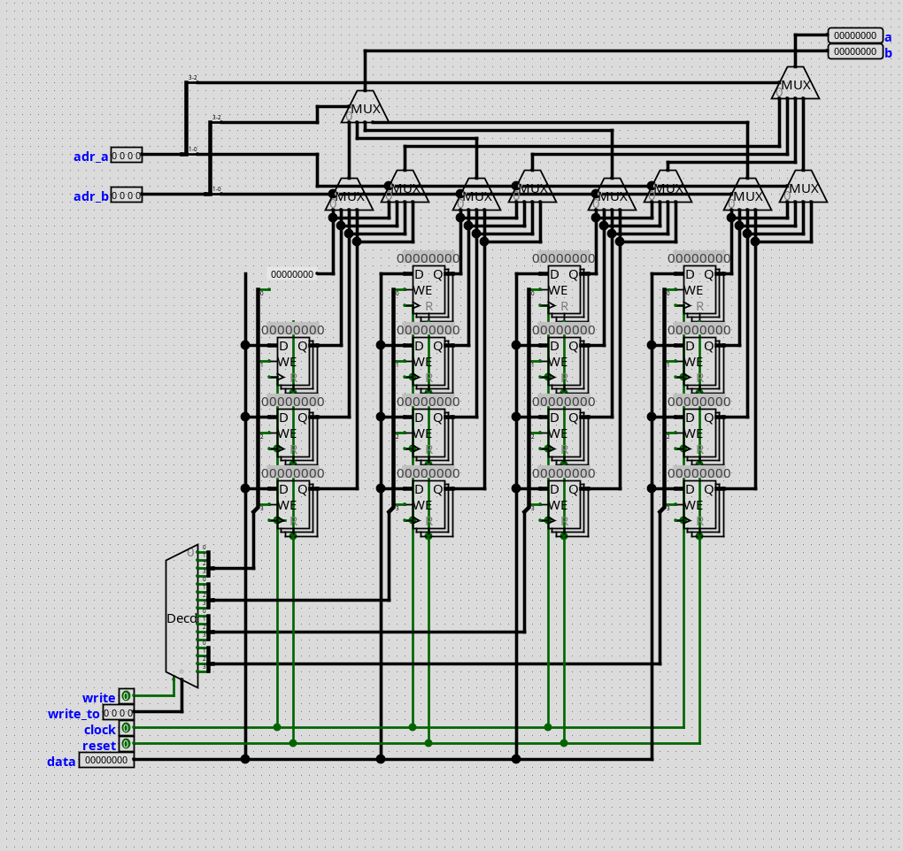
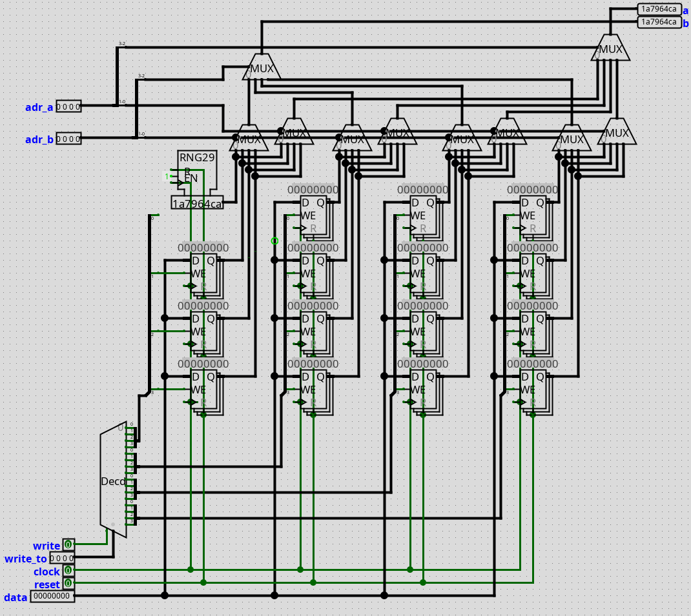
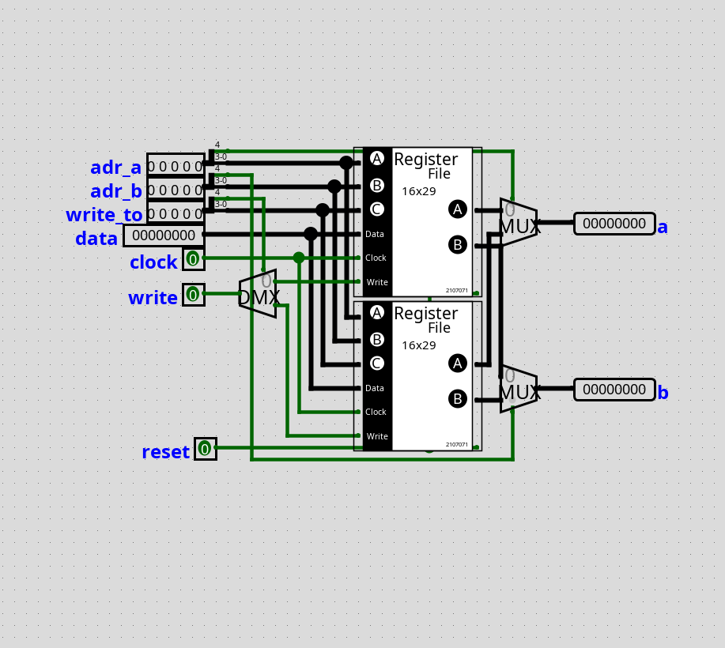
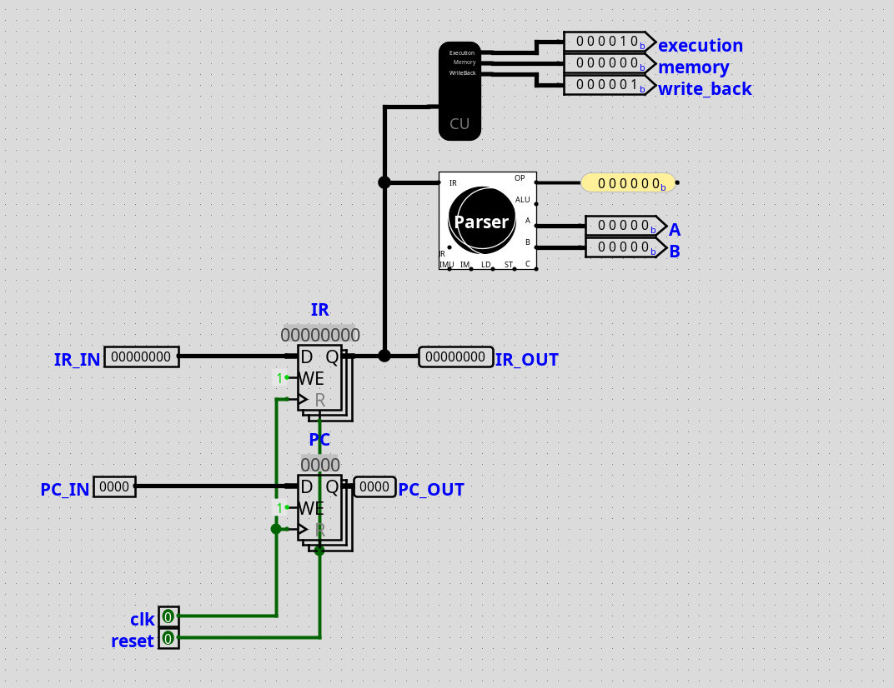
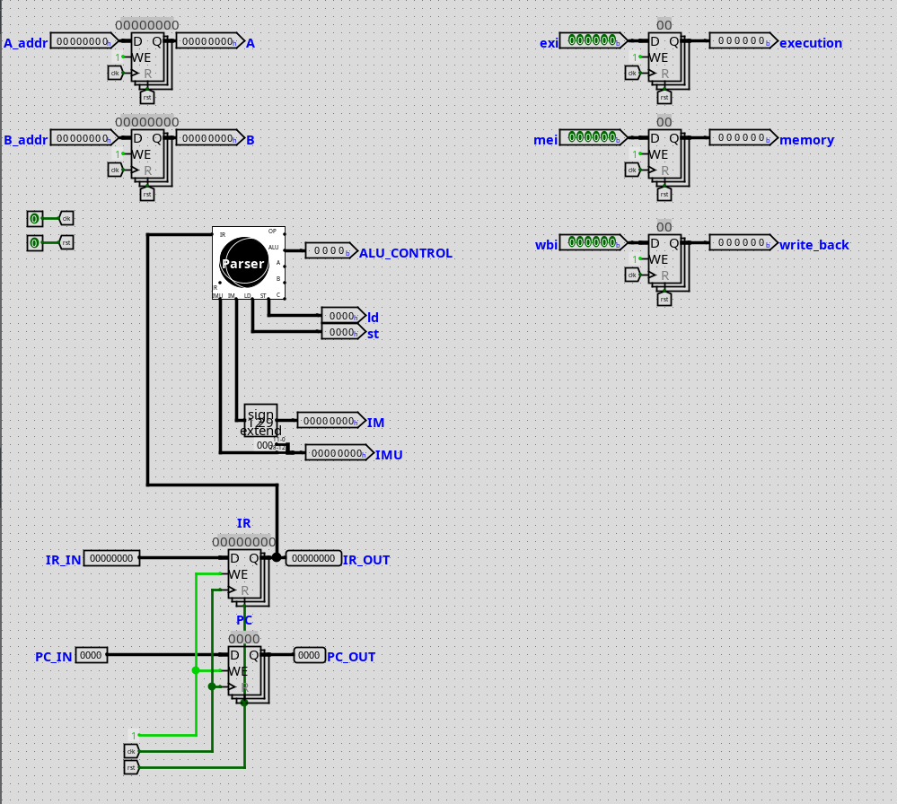
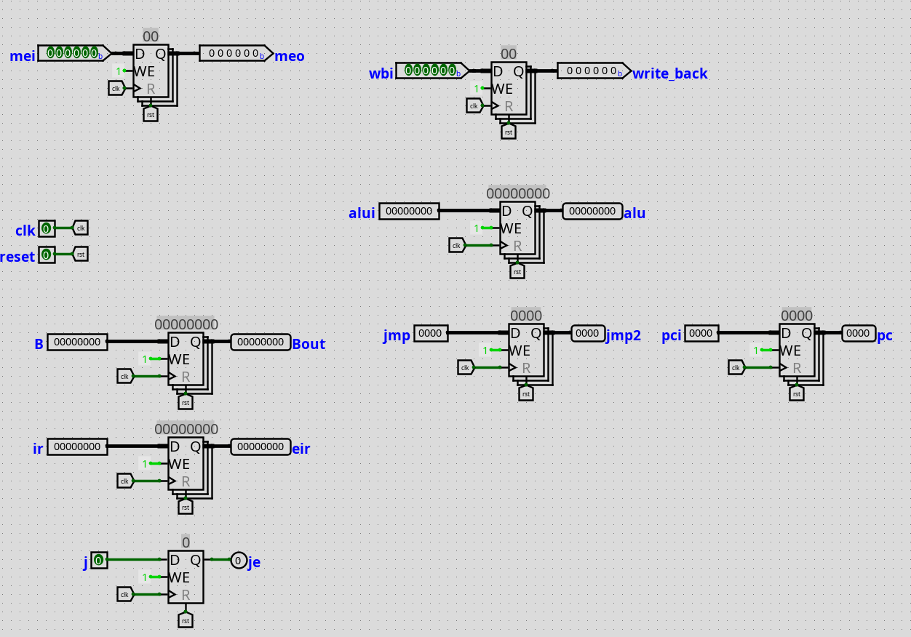

# Hardware and Instruction set Design
## Instruction 
The RISC-V 2.0 instruction set was heavily followed during building the instruction set. Each instruction is of fixed size - 29 bits. 

| Name                      | Size | Range      |
|---------------------------|------|------------|
| Opcodes                   | 6    | 0-5        |
| Destination Register (rd) | 5    | 5-9        |
| Register Select (rs1)     | 5    | 10-14      |
| Register Select  (rs2)    | 5    | 15-19      |
| Immediate                 | 14   | 17-28      |
| Immediate UP              | 17   | 12-28      |
| Load Address              | 16   | 13-28      |
| Store Address             | 16   | 5-15,22-28 |
| Jump Relative             | 13   | 5-9,20-28  |

### Instruction formats
> As designed in hardware , doesn't resemble software instruction set

| Type              | Format                      |
|-------------------|-----------------------------|
| ALU               | op `rd`,`rs1`,`rs2`      	 	|
| ALU Immediate     | op `rd`,`rs1`,`immediate`   |
| Jump              | op `rs1`,`rs2`,`immediate`  |
| Jump linked       | op `rd`,`immediate`        	|
| Load              | load `rd`,`rs1`            	|
| Store             | store  `rs1`,`rs2`         	|
| Load (Immediate)  | load `rd`,`load address`   	|
| Store (Immediate) | store `store address`,`rs2`	|
| In                | in `rd`,`rs2`              	|
| Out               | out `rs2`,`rs1`            	|
| In (Immediate)    | in `rd`,`load address`     	|
| Out (Immediate)   | out `rs2`,`store address`  	|

### Control Signals
<figure>

<caption> Control signals - click to zoom</caption>
</figure>

## Pipelining 

Stages are volatile states for each units. These hold the value of necessary information to use multiple operational units process in parallel (not execution - this system has one execution unit, it is meant for fetch,decode,execute,memory,write back units parallel operation on different instructions) 

#### First Stage : Fetch
Fetch from Program Memory -> Store to Intermediate Registers (IFID)

#### Second Stage : Register Read

Save values of registers from Register file to Intermediate Registers (IFEX)

#### Third Stage : Execution

Perform ALU operation,and, calculate branch. Save Results to Intermediate Registers (EXMEM)

#### Fourth Stage : Memory access

Read/Write to memory or IO,Jump , Save Results to Intermediate Registers (MEMWB)

#### Fifth Stage 

Write back to register File. End of cycle.

## Circuits
### Data Extraction
This unit extracts data arranged in 29 bit instruction. 

<figure><caption>Parser</caption></figure>

### Arithmetic and Logic Unit

It's a arithmetic and logic unit capable of performing 29 bit arithmetic and logical operations. The Adder is a carry look ahead adder. Multiplicator and Dividers are hardwired logisim asynchronous unit (supports vhdl)
<figure><caption> Arithmetic and Logic Unit</caption></figure>

### Branch Unit
This unit does a clever optimization by setting the opcodes similar to comparator result.
<figure><caption>Branch Unit</caption></figure>

### Control Unit
Requires a Single line (As RISC)

<figure><caption>Control unit</caption></figure>

### Register File

The register r0 is hardwired to 0 and r16 is a random generator. The Register file facilitates 2 read and 1 write at a single clock pulse.

<caption>Register File A</caption>

<caption>Register File B</caption>

<figure>
<caption>Register File</caption></figure>

### Pipeline Registers

<figure style="margin:4%;float:left;width:40%">
<h4>IF|ID</h4>

<caption>It decodes the instruction and send it though</caption>
</figure>

<figure style="margin:4%;float:left;width:40%">
<h4>ID|EX</h4>
<caption>Read the Registers and gives to execution unit</caption></figure>

<figure style="margin:4%;float:left;width:40%">
<h4>EX|MEM</h4>
<caption>Hold addresses and data</caption></figure>

<figure style="margin:4%;float:left;width:40%">
<h4>MEM|WB</h4>
<caption>Hold received data</caption></figure>

### Controllers

#### IO Address
|Address|IO|
|-|-|
|000|TTY|
|001| 7 Segment|
|010| Display|
|100| KeyBoard|
|101| Immediate|
|110| Joystick |
#### Video Controller

