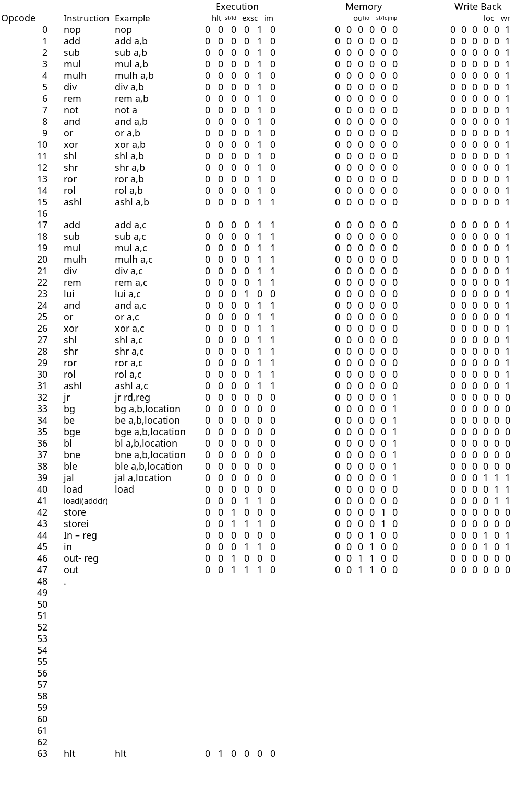
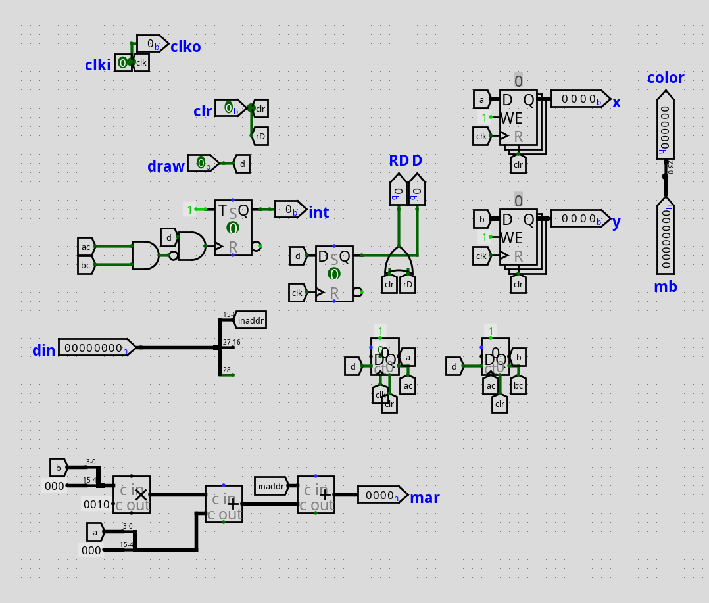

# Computer Project

Objectives and Achievements:

- [x] The machine should follow RISC architecture.
- [x] The machine should be pipe-lined.
- [x] The machine should support Arithmetic,Load, Store, and JMP instructions similar to RISC-v model
- [x] the CPU should support IO communication
- [ ] Design a compiler - *WIP*
- [ ] Implementation of high level functionalities, such as push/pop, move, load 29 bits directly,jump if zero etc : depends on compiler
- [ ] Design some sample programs for testing the CPU.
- [ ] Preset of interrupt set - stored in ROM.

## Instruction 
Instructions are alike RISC instructions, requiring 1 CPU cycle to complete their execution. Each instruction is of fixed size :29 bits. Instruction generic format :

| Name                      | Size | Range      |
|---------------------------|------|------------|
| Opcodes                   | 6    | 0-5        |
| Destination Register (rd) | 5    | 5-9        |
| Register Select (rs1)     | 5    | 10-14      |
| Register Select  (rs2)    | 5    | 15-19      |
| Immediate                 | 14   | 15-28      |
| Immediate UP              | 17   | 12-28      |
| Load Address              | 16   | 13-28      |
| Store Address             | 16   | 5-15,22-28 |
| Jump Relative             | 13   | 5-9,20-28  |

### Instruction formats
| Type              | Format                |
|-------------------|-----------------------|
| ALU               | `op rd,rs1,rs2`       |
| ALU Immediate     | `op rd,rs1,Immediate` |
| Jump              | op rs1,rs2,Immediate  |
| Jump linked       | op rd,Immediate       |
| Load              | load rd,rs1           |
| Store             | store  rs1,rs2        |
| Load (Immediate)  | load rd,ldaddr        |
| Store (Immediate) | store stadaddr,rs2    |
| In                | in rd,rs2             |
| Out               | out rs2,rs1           |
| In (Immediate)    | in rd,loaddr          |
| Out (Immediate)   | out rs2,staddr        |

### Instructions (High Level)

#### First Stage : Fetch
Fetch from Program Memory -> Store to Intermediate Registers (IFID)

#### Second Stage : Register Read
Save values of registers from Register file to Intermediate Registers (IFEX)

#### Third Stage : Execution
Perform ALU operation, Save Results to Intermediate Registers (EXMEM)

#### Fourth Stage : Memory access
Read/Write to memory or IO, Save Results to Intermediate Registers (MEMWB)

#### Fifth Stage 
Write back to register File. End of cycle.

## Circuits
### Instruction Decoding

### Arithmetic and Logic Unit

### Branch Unit

### Control Unit

Requires a Single line (As RISC)

### Register File

### Pipeline Registers

#### IF|ID

### ID|EX

#### EX|MEM

### MEM|WB

### Video Controller

## IO Address
> 000 TTY

> 001 7 Segment

> 010 Display

> 100 KeyBoard

> 101 Immediate

> 110 Joystick 

## Notes

* The r0 has a fixed value : 0 , which is useful for implementing various high level features such as mov or jz. The r16 produces random value.
* Incase of jumps the later 3 instructions must be replaced with nop
## References
* https://stackoverflow.com/questions/55454314/how-to-implement-cisc-pipelined-cpu-right
* https://www.researchgate.net/figure/Block-diagram-of-RISCV-SoC-and-its-five-stage-RISC-V-processor-Resources-from-different_fig3_363175823
* https://en.wikipedia.org/wiki/Classic_RISC_pipeline
* https://inst.eecs.berkeley.edu/~cs61c/resources/su18_lec/Lecture12.pdf
* https://passlab.github.io/CSCE513/notes/lecture08_RISCV_Impl_pipeline.pdf
* https://www.cs.cornell.edu/courses/cs3410/2019sp/riscv/interpreter/
* https://courses.cs.washington.edu/courses/cse378/10sp/lectures/lec11.pdf
* https://www.cs.fsu.edu/~zwang/files/cda3101/Fall2017/Lecture8_cda3101.pdf

