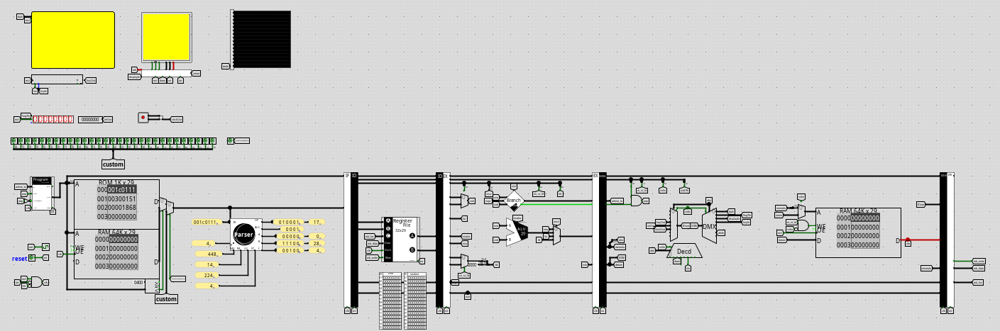

# Computer emulation in Logisim Evolution

<figure>

<caption> An early stage program showcasing Output</caption>
</figure>

<figure>

<caption> I/O Operation</caption>
</figure>
Hello There!
It's a repository showcasing my CSE2114 (Computer Architecture Sessional) project. The task was to build a 29 bit computer with at least 4 instructions. As it was an open ended project I added some extra objectives.

## Objectives

- [x] Building a computer with instruction set similar to **RISC-V** , in **Harvard architecture**
- [x] Make the computer five stage **pipelined**
- [x] The computer should support **IO** device interfacing
- [x] Design A **compiler**, the compiler should provide higher level functionalities such as push/pop,mov etc.
- [ ] Code a snake game
- [ ] Design preset **bootloader** and **interrupt** set

## The Project

Open the [CPU.circ](CPU.circ) file in [Logisim Evolution](https://github.com/logisim-evolution/logisim-evolution). Write assembly codes following the [Assembly Manual](assembly.md) and compile/assemble using the compiler (Requires [NodeJS](https://nodejs.org/en)).

```bash
./translate file.asm
```

<figure>

<caption> The computer designed in Logisim Evolution</caption>
</figure>

The details on the hardware design can be found [here](./design.md). Learn about the [Compiler Design](./compiler.md)
<br>
<br>

## Notes

- The r0 has a fixed value : 0 , which is useful for implementing various high level features such as mov or jz. The r16 produces random value.
- In case of jumps the later 3 instructions must be replaced with nop
- Cache was not added as it'd require interrupt management system and slow down the computer
- No register on WB - Memory (As memory already takes one clock extra), May need to add buffer on every IO
- While debugging hard errors can be detected by checking current status (line status); most hard errors are delay related. In case of soft error / resource conflict, it must be resolved by the assembler (pause command in case of conflict, if placable place other instruction else place nop).

## References

- [Wikipedia - RISC-V](https://en.wikipedia.org/wiki/RISC-V)
- [The RISC-V Instruction Set Manual](https://riscv.org/wp-content/uploads/2017/05/riscv-spec-v2.2.pdf)
- [Stack Overflow - How to implement CISC Pipeline](https://stackoverflow.com/questions/55454314/how-to-implement-cisc-pipelined-cpu-right)
- [ResearchGate - RISC-V](https://www.researchgate.net/figure/Block-diagram-of-RISCV-SoC-and-its-five-stage-RISC-V-processor-Resources-from-different_fig3_363175823)
- [Wikipedia - Clasic RISC Pipeline](https://en.wikipedia.org/wiki/Classic_RISC_pipeline)
- [Berkeley - RISC-V CPU Control, Pipelining](https://inst.eecs.berkeley.edu/~cs61c/resources/su18_lec/Lecture12.pdf)
- [RISC-V Pipeline
  Implementation](https://passlab.github.io/CSCE513/notes/lecture08_RISCV_Impl_pipeline.pdf)
- [Cornell - RISC-V Interpreter](https://www.cs.cornell.edu/courses/cs3410/2019sp/riscv/interpreter/)
- [Washington - Pipelining](https://courses.cs.washington.edu/courses/cse378/10sp/lectures/lec11.pdf)
- [FSU - Pipelined Datapath](https://www.cs.fsu.edu/~zwang/files/cda3101/Fall2017/Lecture8_cda3101.pdf)
